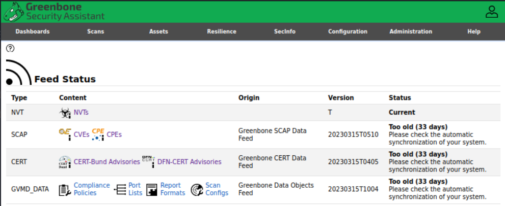

# Project: Assess the Vulnerability with GVM (OpenVAS)
## Description
[GVM (OpenVAS)](https://www.openvas.org/) is a powerful vulnerability scanner. It can be used to scan the vulnerabilities of popular operating systems such as Linux, Windows and MacOS.

This project consists of three tasks:
1. Install GVM (OpenVAS)
2. Download and run vulnerable systems
   1. [metasploitable3-ub1404](https://app.vagrantup.com/rapid7/boxes/metasploitable3-ub1404)
   2. [metasploitable3-win2k8](https://app.vagrantup.com/rapid7/boxes/metasploitable3-win2k8)
3. With GVM (OpenVAS), scan the vulnerabilities and generate report for 
   1. [metasploitable3-ub1404](https://app.vagrantup.com/rapid7/boxes/metasploitable3-ub1404)
   2. [metasploitable3-win2k8](https://app.vagrantup.com/rapid7/boxes/metasploitable3-win2k8)
   3. The Windows server VM installed in Lab00

**Recommendation**:
- Download and run the current [Kali Linux](https://www.kali.org/get-kali)

## Steps
Task 1 (40%): Install GVM (OpenVAS)
---
- Install, configure and use OpenVAS (GVM - Greenbone Vulnerability Management) on Kali VM
- Method 1. Install locally 

```bash
# 0. update and upgrade Kali
sudo apt update -y
sudo apt upgrade -y

# 1. Install gvm
sudo apt install openvas

# 2. setup gvm
sudo gvm-setup # take a few minutes to complete
# If you see a message "User created with password: <long-random string>",
# NOTE DOWN THE PASSWORD
# then it is setup successfully, otherwise, create a user admin manually
# change mypasswd to yours
sudo gvmd --user=admin --new-password mypasswd

# create a user kali
sudo gvmd --user=kali --new-password kali

# 3. continue running the following command until it reports setup is ok
sudo gvm-check-setup

# 4. update gvm databases of CVEs and NVTs (Network Vulnerability Threats)
sudo gvm-feed-update

# 5. start gvm
sudo gvm-start

# !!!! KEEP YOUR VM RUNNING OVER NIGHT, IT MAY UPDATE THE DATABASE.

# 6. use gvm
# 6.1 start gvm, it will open a browser automatically
sudo gvm-start
# 6.2 If no brower opened automatically. open a brower, go to https://127.0.0.1:9392
# For the warning, click Advanced, accept risk and continue
# login with the user admin created above

# 7. scan local & remote computers
# 7.1 create target from tab Configuration
# 7.2 create scan task from tab Scan Management

# 8. scan the target

# Note: Fix Error "The SCAP database is required
sudo gvm-stop

sudo runuser -u _gvm --  greenbone-nvt-sysnc
sudo runuser -u _gvm --  greenbone-feed-sync --type SCAP
sudo runuser -u _gvm --  greenbone-feed-sync --type CERT
sudo runuser -u _gvm --  greenbone-feed-sync --type GVMD_DATA

sudo reboot
```

- Method 2. Install with docker

```bash
# 1. update and upgrade kali
sudo apt update -y && sudo apt upgrade -y

# 2. install docker
sudo apt install curl docker.io docker-compose

# 3. allow the current user to run docker
sudo usermod -aG docker $USER && su $USER

# 4. download the Greenbone Community Edition docker compose file
export DOWNLOAD_DIR=$HOME/greenbone-community-container && mkdir -p $DOWNLOAD_DIR

cd $DOWNLOAD_DIR && curl -f -L https://greenbone.github.io/docs/latest/_static/docker-compose-22.4.yml -o docker-compose.yml

# 5. download the container image
docker-compose -f $DOWNLOAD_DIR/docker-compose.yml -p greenbone-community-edition pull

# 6. Starting the Greenbone Community Containers
docker-compose -f $DOWNLOAD_DIR/docker-compose.yml -p greenbone-community-edition up -d

# By default, a user admin with the password admin is created
# If you want to change the password of admin
docker-compose -f $DOWNLOAD_DIR/docker-compose.yml -p greenbone-community-edition \
    exec -u gvmd gvmd gvmd --user=admin --new-password=<password>

#!!!! After the services have started and all feed data has been loaded,
# the Greenbone Security Assistant web interface – GSA – 
# can be opened in the browser.
xdg-open "http://127.0.0.1:9392" 2>/dev/null >/dev/null &  

# !!!! KEEP YOUR VM RUNNING OVER NIGHT, IT MAY UPDATE THE DATABASE.
```

For a successful installation, in GVM, check Administration -> Feed Status, the status of all types must be current.



Task 2 (20%): Download and run vulnerable systems
---
[metasploitable3-ub1404](https://app.vagrantup.com/rapid7/boxes/metasploitable3-ub1404) and [metasploitable3-win2k8](https://app.vagrantup.com/rapid7/boxes/metasploitable3-win2k8) are provided as virtual machine images, 
- download the appropriate versions  
- use 7-zip or gunzip to extract the archive, for the VirtualBox images,
  - it needs to extract twice with 7-zip
  - find the box.ovf and copy it to the folder contains the vmdk file
  - open box.ovf with VirtualBox and import it
- attach them to the same NAT network as your Kali VM
- correct any invalid settings
- run them in your virtual machine manager environment

**Note**: the default login credential: 
- user: vagrant
- pass: vagrant


Task 3 (40%): Scan system vulnerabilities
---
- With GVM (OpenVAS), scan the vulnerabilities of 
  - [metasploitable3-ub1404](https://app.vagrantup.com/rapid7/boxes/metasploitable3-ub1404), 
  - [metasploitable3-win2k8](https://app.vagrantup.com/rapid7/boxes/metasploitable3-win2k8)  
  - the Windows server in the NAT network.
  - the scan type should be full and deep
- Generate report for each scan
- Discuss the top 3 vulnerabilities of each system
  - effects on the system
  - exploitation on these vulnerabilities
  - fix, patch or update of these vulnerabilities


# Reference
- [GVM on Kali](https://www.kali.org/tools/gvm/)
- [Greenbone Community Containers](https://greenbone.github.io/docs/latest/22.4/container/index.html)
  - [Performing a Feed Synchronization](https://greenbone.github.io/docs/latest/22.4/container/workflows.html)
  - [GVM Glossary](https://greenbone.github.io/docs/latest/glossary.html)
- [OpenVAS Tutorial: how to use openvas](https://ethicalhackingguru.com/openvas-tutorial-how-to-use-openvas/)
- [Metasploitable3](https://github.com/rapid7/metasploitable3)