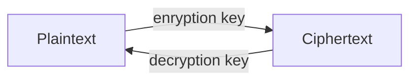
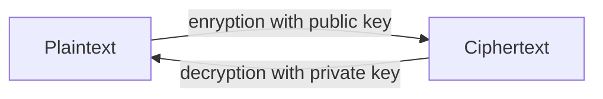
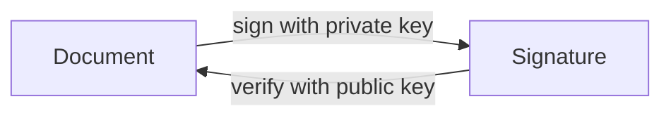

# Cryptography

Topics
---
- Mathematical Basis
  - Symmetric encryption
  - Asymmetric encryption
  - Hashing
- Implementation
  - Public-Key Infrastructure
  - Cryptographic Attacks


Cryptography
---
- the process of converting plaintext into ciphertext
  - Plaintext: readable text (also called cleartext)
  - Ciphertext: unreadable or encrypted text
- used to hide information from unauthorized users
- Decryption is the process of converting ciphertext back to plaintext


Substitution cipher
---
- Replaces one letter with another letter based on a key
- Example, alphabet shifting ciphers: 
  - Julius Caesar’s Cipher (key is 3)
  - ROT-13 (key is 13)
    - PerformingROT-13twice undoes it
    - Obfuscation,not Encryption


Cryptanalysis
---
- studies the process of breaking encryption algorithms
- When a new encryption algorithm is developed, cryptanalysts
  - study it and try to break it
  - or prove that it is impractical to break it 
    - taking much time and many resources


Practice 📝
---
- Use [this online shifting cipher](https://www.cryptool.org/en/cto/caesar) to
  - Encrypt the message below with key 7
    ```
    Ethical hacking is fun!
    ```
  - Crack the ciphertext below
    ```
    kyv vEvDP zJ CFtrKvu. cvK'u rKKrtB KFEzxyK!
    ```


Enigma
---
- used by the Germans during World War II
  - Replaced letters as they were typed
  - Substitutions were computed using a key and a set of switches or rotors


Practice 📝
---
- play with the following enigma emulators
  - [A 3d virtual enigma](https://enigma.virtualcolossus.co.uk/VirtualEnigma/)
  - [A Enigma Machine Emulator](https://www.101computing.net/enigma-machine-emulator/)


Steganography
---
- The process of hiding data in plain view in pictures, graphics, or text
  - Example: changing colors slightly to encode individual bits in an image


Practice 📝
---
- Play with [StegOnline](https://stegonline.georgeom.net/upload)


Cryptographic Algorithms
---
- a mathematical function or program that works with a key
- Security comes from
  - A strong algorithm—one that cannot be reversed without the key
  - A key that cannot be found or guessed


Keys
---
- A sequence of random bits
  - The range of allowable values is called a keyspace
- The larger the keyspace, the more secure the key
  - $n$-bit key has $2^n$ values in space
  - $56$-bit key  has $2^{56} = 7 \times 10^{16}$ values
  - $128$-bit key has $2^{128} = 3 \times 10^{38}$ values


Brute Force 
---
- In 1997 a 56-bit key was broken by brute force
  - Testing all possible 56-bit keys
  - Used 14,000 machines organized via the Internet
  - It took 3 months


Practice 📝
---
- Assume a computer can  averagely try $10^{10}$ keys in one second?
  - How long does it take to try all possible keys of length $128$-bit?


Symmetric Cryptography
---
- Encryption and decryption use the same key




Symmetric Cryptography Algorithms
---
- use one key for encryption and decryption
- Advantages
  - fast
  - difficult to break if a large key size is used
  - Only one key needed
- Disadvantages
  - keys must remain secret
  - Difficult to deliver keys (key distribution)
  - don’t provide authenticity or nonrepudiation
  - unsure who sent the message, since two people have the same key
- Types of symmetric algorithms
  - Stream ciphers
    - Operate on plaintext one bit at a time
  - Block ciphers
    - Operate on blocks of plaintext


Decrypt DVD with [DeCSS](https://en.wikipedia.org/wiki/DeCSS)
---
- Commercial DVDs are encoded with a 40-bit key
  - It’s simple to crack it by brute force
  - Three hackers did that in 1999
- Legislation such as the [Digital Millennium Copyright Act (DMCA)](https://en.wikipedia.org/wiki/Digital_Millennium_Copyright_Act)
  - made it illegal to publish the algorithm


Reading 📝
---
- [Why the DVD Hack Was a Cinch](https://www.wired.com/1999/11/why-the-dvd-hack-was-a-cinch/)
- [Illegal number](https://en.wikipedia.org/wiki/Illegal_number)
- [Top 5 Linux DVD RIP Software](https://www.cyberciti.biz/tips/linux-dvd-ripper-software.html)
  - AcidRIP, DVD::RIP, HandBrake, dvdbackup, thoggen, then can be installed as
    ```bash
    sudo apt install acidrip dvdrip handbrake dvdbackup thoggen
    ```


Data Encryption Standard (DES)
---
- National Institute of Standards and Technology (NIST)
  - Wanted a means of protecting sensitive but unclassified data
  - Invited vendors in early 1970 to submit data encryption algorithms
- IBM proposed Lucifer
  - A 128-bit encryption algorithm
- The National Security Agency (NSA) 
  - reduced the key size from 128 bits to 64 bits and created DES
    - Only 56 bits of the key are actually used
- In 1988, NSA thought the standard was at risk to be broken
- In 1997, a DES key was broken in 3 months
- In 1998, [the Electronic Frontier Foundation (EFF) built a computer system that cracked a DES key in 3 days](https://w2.eff.org/Privacy/Crypto/Crypto_misc/DESCracker/HTML/19990119_deschallenge3.html)


Practice 📝
---
- [DES encryption & decrytpion online](https://encode-decode.com/des-encrypt-online/)
- Use DES in Python package pycryptodome 
  ```bash
  # 1. Install Python package pycryptodome in Kali
  sudo pip3 install pycryptodome
  ```
  ```python
  # 2. encrypt & decrypt using DES
  from Crypto.Cipher import DES
  key = b'password' # must be 8bytes, ie. 64bits
  plaintext = b'Ethical hacking is fun!'
  e_cipher=DES.new(key, DES.MODE_OFB)
  e_data =e_cipher.encrypt(plaintext)
 
  d_cipher = DES.new(key, DES.MODE_OFB, e_cipher.iv)
  d_data = d_cipher.decrypt(e_data)

  print("encrypted text: ", e_data)
  print("decrypted text: ", d_data)
  print("decrypted text == plaintext? ", d_data == plaintext)
  ```


Triple DES (3DES)
---
- Triple Data Encryption System (3DES)
- 3DES served as a quick fix to the vulnerabilities of DES
- 3DES performs three DES encryptions 
- $2^{56}$ times stronger than DES
  - More secure but slower to compute


Advanced Encryption Standard (AES)
---
- Became effective in 2002 as a standard
  - The process took 5 years
- Block cipher that operates on 128-bit blocks of plaintext
- Key length can be 128, 192, or 256 bits
- Uses Rindjael algorithm


Practice 📝
---
- [AES encryption & decrytpion online](https://encode-decode.com/aes128-encrypt-online/)
- Use AES in Python package pycryptodome 
  ```bash
  # 1. Install Python package pycryptodome in Kali
  sudo pip3 install pycryptodome
  ```
  ```python
  # 2. encrypt & decrypt using AES
  from Crypto.Cipher import AES
  key = b'passwordpassword' # must be 16bytes, ie. 128bits
  plaintext = b'Ethical hacking is fun!'
  e_cipher=AES.new(key, AES.MODE_OFB)
  e_data =e_cipher.encrypt(plaintext)
 
  d_cipher = AES.new(key, AES.MODE_OFB, e_cipher.iv)
  d_data = d_cipher.decrypt(e_data)

  print("encrypted text: ", e_data)
  print("decrypted text: ", d_data)
  print("decrypted text == plaintext? ", d_data == plaintext)
  ```


International Data Encryption Algorithm (IDEA)
---
- Block cipher that operates on 64-bit blocks of plaintext
- It uses a 128-bit key
- Developed by Xuejia Lai and James Massey
  - Designed to work more efficiently in computers used at home and in businesses
- IDEA is free for noncommercial use
  - It is included in PGP encryption software


Blowfish
---
- Block cipher that operates on 64-bit blocks of plaintext
- The key length can be as large as 448 bits
- Developed by Bruce Schneier


RC4
---
- The most widely used stream cipher
- Used in WEP and WPA (part of TKIP)
- Also used in some versions of TLS
- Weakness: RC4 is biased--some byte sequences are more common than others
  - Can decrypt an HTTPS cookie in 75 hours
    - If RC4 is used
  - Can break WPA-TKIP within an hour


Reading 📝
---
- [RC4 crypto: Get RID of it already, say boffins](https://www.theregister.com/2015/07/16/rc4_get_rid_of_it_already_say_boffins/)
- [RC4 NOMORE: Numerous Occurrence MOnitoring & Recovery Exploit](https://www.rc4nomore.com/)


RC5
---
- Block cipher that can operate on different block sizes: 32, 64, and 128
- The key size can reach 2048 bits
- Created by Ronald L. Rivest in 1994 for RSA Data Security


Cracking RC5
---
- 56-bit and 64-bit key RC5s have already been cracked
- The RC5-72 project is underway, trying to crack a 72-bit key
  - At the current rate, it will take 1000 years


Symmetric Algorithms(Private-key)
---

| Name     | Key size/bits | Notes                    |
| -------- | ------------- | ------------------------ |
| DES      | 56            | insecure                 |
| 3DES     | 168           | replaced by AES          |
| AES      | 128,192,256   | US gov classified info   |
| IDEA     | 128           | used in PGP, very secure |
| Blowfish | 32 to 448     | public domain            |
| RC5      | up to 2040    | secure for 72bits+       |


Asymmetric Cryptography
---
- Use two keys that are mathematically related
  - Data encrypted with one key can be decrypted only with the other key
- Another name: public key cryptography
  - Public key: known by the public, for encryption
  - Private key: known only by owner, for decryption
  - like a mailbox?



- Provides message authenticity and nonrepudiation
  - Authenticity validates the sender of a message
  - Nonrepudiation means a user cannot deny sending a message



- Asymmetric algorithms are more scalable but slower than symmetric algorithms
  - Scalable: can adapt to larger networks
  - Each person needs only one key pair
    - Everyone can use the same public key to send you data
    - Each person signs messages with their own private key


Asymmetric Cryptography Algorithm - RSA
---
- Developed in 1977 by Ronald L. Rivest, Adi Shamir, and Leonard M. Adleman
- The algorithm is based on *the difficulty of factoring large numbers*
- The Secure Socket Layer (SSL) protocol uses the RSA algorithm


Practice 📝
---
- [RSA encryption & decrytpion online](https://www.javainuse.com/rsagenerator)
- Use RSA in Python package pycryptodome 
  ```bash
  # 1. Install Python package pycryptodome in Kali
  sudo pip3 install pycryptodome
  ```
  ```python
  # 2. encrypt & decrypt using RSA
  from Crypto.PublicKey import RSA
  from Crypto.Cipher import PKCS1_OAEP

  key = RSA.generate(1024) # key length 1024bits
  plaintext = b'Ethical hacking is fun!'
  
  cipher_ras = PKCS1_OAEP.new(key)
  e_data = cipher_ras.encrypt(plaintext)
 
  d_data = cipher_ras.decrypt(e_data)

  print("encrypted text: ", e_data)
  print("decrypted text: ", d_data)
  print("decrypted text == plaintext? ", d_data == plaintext)
  ```


Key-exchange algorithm: Diffie-Hellman
---
- Developed by Whitfield Diffie and Martin Hellman
- Does not provide encryption but is used for key exchange
  - Two parties agree on a key without ever sending it directly over the network
  - The numbers transmitted can be used to compute the key, but only by the parties holding secret private numbers
- Prevents sniffing attacks


Elliptic Curve Cryptosystem (ECC)
---
- an efficient algorithm requiring few resources
  - Memory
  - Disk space
  - Bandwidth
- used for encryption as well as digital signatures and key distribution


Elgamal
---
- Public key algorithm used to
  - Encrypt data
  - Create digital signature
  - Exchange secret keys
- Written by Taher Elgamal in 1985
- The algorithm uses discrete logarithm problems
  - Solving a discrete logarithm problem can take many years and require CPU-intensive operations


Reading 📝
---
- [Stop using NSA-influenced code in our products, RSA tells customers](https://arstechnica.com/information-technology/2013/09/stop-using-nsa-influence-code-in-our-product-rsa-tells-customers/)
  - [CVE-2007-6755 Detail](https://nvd.nist.gov/vuln/detail/CVE-2007-6755)
  - [NSA: NOBUS ("Nobody But Us")](https://en.wikipedia.org/wiki/NOBUS)
  - [Silent Circle ditches NIST cryptographic standards to thwart NSA spying](https://www.pcworld.com/article/447932/silent-circle-moves-away-from-nist-cryptographic-standards-cites-uncertainty.html)
  - [The NSA Is Breaking Most Encryption on the Internet](https://www.schneier.com/blog/archives/2013/09/the_nsa_is_brea.html)
    - [How NSA successfully Broke Trillions of Encrypted Connections](hhttps://arstechnica.com/information-technology/2015/10/how-the-nsa-can-break-trillions-of-encrypted-web-and-vpn-connections/)
  - [CNSA 2.0 and Quantum computing FAQ](https://media.defense.gov/2022/Sep/07/2003071836/-1/-1/0/CSI_CNSA_2.0_FAQ_.PDF)


NSA & Quantum Computing
---
- The public-key algorithms (RSA, Diffie-Hellman, ECDH, and ECDSA) are all vulnerable to attack by a sufficiently large quantum computer
- Quantum computing techniques are much less effective against symmetric algorithms than against widely used public key algorithms
- AES-256 and SHA-384 are believed to be safe from attack by a large quantum computer
- National Security System (NSS) should now use these key sizes:
  - Elliptic Curves: 384 bits
  - RSA & Diffie-Hellman: 3072 bits
- Since a handful of primes are so widely reused, …
- Breaking a single, common 1024-bit prime would allow NSA to passively decrypt connections to two-thirds of VPNs and a quarter of all SSH servers globally.
- Breaking a second 1024-bit prime would allow passive eavesdropping on connections to nearly 20% of the top million HTTPS websites


Digital Signature Standard (DSS)
---
- Established by the NIST in 1991
  - Ensures that digital signatures rather than written signatures can be verified
- Federal government requirements
  - RSA and Digital Signature Algorithm (DSA) must be used for all digital signatures
  - Hashing algorithm must be used to ensure the integrity of the message
    - NIST required that the Secure Hash Algorithm (SHA) be used


Pretty Good Privacy (PGP)
---
- Developed by Phil Zimmerman as a free e-mail encryption program
  - Zimmerman was almost arrested for his innovation
  - Back in the mid-1990s, any kind of “unbreakable” encryption was seen as a weapon and compared to selling arms to the enemy
- a free public key encryption program
- uses certificates similar to those in public key infrastructure (PKI)
  - not use a centralized CA
  - Verification of a certificate is not as efficient as PKI
- Algorithms supported by PGP
  - IDEA，RSA，DSA，
  - Message Digest 5 (MD5)，SHA-1


Secure Multipurpose Internet Mail Extension (S/MIME)
---
- another public key encryption standard used to encrypt and digitally sign e-mail
- Can encrypt e-mail messages containing attachments 
- Can use PKI certificates for authentication
- version 2 defined in RFC 2311
- version 3 defined in RFC 2633


Privacy-Enhanced Mail (PEM)
---
- Internet standard that is compatible with both symmetric and asymmetric methods of encryption
- Can use the X.509 certificate standards and encrypt messages with DES
- Not used as much today
  - MIME Object Security Services (MOSS) is a newer implementation of PEM


Asymmetric Algorithms(Public-key)
---

| Name           | Notes                        |
| -------------- | ---------------------------- |
| Diffie-Hellman | key exchange, not encryption |
| RSA            | secure, used by SSL          |
| ECC            | efficient new algorithm      |
| Elgamal        | used in GPG and PGP          |


Hashing Algorithms
---
- Take a variable-length message and produce a fixed-length value called a message digest
- A hash value is equivalent to a fingerprint of the message
  - If the message is changed later, the hash value changes


Collisions
---
- If two different messages produce the same hash value, it results in a collision
  - A good hashing algorithm must be collision-free
- MD5 has known collisions
  - It was never approved by NIST for any purpose


SHA-1
---
- SHA-1 is one of the most popular hashing algorithms
- Approved by NIST
- Replaced MD5 for decades


Practice 📝
---
- Use [online hash tools](https://www.pelock.com/products/hash-calculator)
- Use Python package hashlib
  ```python
  import hashlib
  p = b'Ethical hacking is fun!'
  print(hashlib.new('md5', p).hexdigest())
  print(hashlib.new('sha256', p).hexdigest())
  ```
- [Test SSL Server](https://www.ssllabs.com/ssltest/analyze.html)
- Read [Google security blog: Announcing the first SHA-1 collision](https://security.googleblog.com/2017/02/announcing-first-sha1-collision.html)
  - Read [SHAttered – first public SHA-1 collision](https://shattered.io/)


Digital Signatures
---
- A hash value ensures that the message was not altered in transit (integrity)
- Asymmetric encryption assures authenticity and nonrepudiation


Hashing Algorithms
---

| Name  | Notes                                                                                       |
| ----- | ------------------------------------------------------------------------------------------- |
| MD2   | written for 8bit machines, no longer secure                                                 |
| MD4   | no longer secure                                                                            |
| MD5   | security is questionable now                                                                |
| SHA-1 | the successor to MD5, used in TLS,SSL, PGP, SSH, S/MIME, IPsec, no longer completely secure |
| SHA-2 | not yet broken                                                                              |
| SHA-3 | approved by NIST in 2015                                                                    |


Explore 🔍
---
- Explore [popular hashes](https://hashcat.net/wiki/doku.php?id=example_hashes)


Public-Key Infrastructure (PKI)
---
- Not an algorithm
- A structure that consists of programs, protocols, and security protocols
- Uses public key cryptography
- Enables secure data transmission over the Internet


PKI Components
---
- Certificate: a digital document that verifies the identity of an entity
  - Contains a unique serial number and must follow the X.509 standard
  - issues by a CA to a company binds a public key to the recipient’s private key


Demo 💡
---
- show a certificate


Certificate Expiration and Renewal
---
- A period of validity is assigned to each certificate
  - After that date, the certificate expires
- A certificate can be renewed with a new expiration date assigned
  - If the keys are still valid and remain uncompromised


Certificate Revocation and Suspension
---
- Reasons to suspend or revoke a certificate
  - A user leaves the company
  - A hardware crash causes a key to be lost
  - A private key is compromised
- Revocation is permanent
- Suspension can be lifted
- Certificate Revocation List (CRL)
  - Contains all revoked and suspended certificates
  - Issued by CA's


HTTP Strict Transport Security
---
- A header field in an HTTP response
  - Tells a browser to load this page securely (via HTTPS)
  - If the certificate is not valid, the browser will block access to that website


Demo 💡
---
- show HTTPS strict-transport-security in a browser
  - browser any HTTPS website, view strict-transport-security from
    - Developer tools -> Network -> Headers


Backing Up Keys
---
- Backing up keys is critical
  - If keys are destroyed and not backed up properly, encrypted business-critical information might be irretrievable
- The CA is usually responsible for backing up keys
  - A key recovery policy is also part of the CA’s responsibility


Certificate Authority Server
---
- can set up your own
- On Windows server
  - Install Certificate Services
  - Specify options to generate certificates, including
    - Cryptographic Service Provider
    - Hash algorithm
    - Key length


Cryptographic Attacks
---
- Sniffing and port scanning are passive attacks – just watching
- Active attacks attempt to determine the secret key being used to encrypt plaintext
- Cryptographic algorithms are usually public
  - Follows the open-source culture
  - Except the NSA and CIA and etc.


Question ❓ [Birthday problem](https://en.wikipedia.org/wiki/Birthday_problem)
---
- If $n$ people are in the room, what is the chance $p$ that they all have different birthdays? $p = \frac{_{365}P_{n}}{365^{n}}$ when $n\le 365$ else 0
- The chance that at least two of them have the same birthday is $1-p$


Birthday Attack
---
- If there are $N$ possible hash values, 
  - You’ll find collisions when you have calculated about $1.2\times \sqrt(N)$ values
- SHA-1 uses a 160-bit key
  - Theoretically, it would require about $2^{80}$ computations to break
  - SHA-1 has known collisions now


Mathematical Attacks
---
- Properties of the algorithm are attacked by using mathematical computations
- Categories
  - Ciphertext-only attack
    - The attacker has the ciphertext of several messages but no plaintext
    - Attacker tries to find out the key and algorithm used to encrypt the messages
    - Attacker can capture ciphertext using a sniffer program such as Wireshark or Tcpdump
- Known plaintext attack
  - The attacker has messages in both encrypted form and decrypted forms
  - This attack is easier to perform than the ciphertext-only attack
  - Looks for patterns in both plaintext and ciphertext
- Chosen-plaintext attack
  - The attacker has access to plaintext and ciphertext
  - Attacker has the ability to choose which message to encrypt
- Chosen-ciphertext attack
  - The attacker has access to the ciphertext to be decrypted and to the resulting plaintext
  - Attacker needs access to the cryptosystem to perform this type of attack


Brute Force Attack
---
- guesses passwords by attempting every possible combination of letters
  - Requires lots of time and patience
  - Password-cracking programs that can use brute force
    - John the Ripper
    - Cain and Abel
    - Ophcrack
      - Also uses memory to save time – “Rainbow tables”


Man-in-the-Middle Attack
---
- Victim sends public key to Server
  - Attacker generates two “false” key pairs
  - Attacker intercepts the genuine keys and send false keys out
  - Both parties send encrypted traffic, but not with the same keys
- These false keys won’t be verified by a CA


SSL/TLS Downgrade Attack
---
- Attacker in the middle can alter a request
  - So that it appears to come from an old system, such as Windows 95
  - Only capable of using old, broken ciphers, such as ones with 40-bit keys
  - Or "export-grade" encryption which was designed to be crackable by the US Gov't
- Fix: configure server to only use secure ciphers


Dictionary Attack
---
- Attacker uses a dictionary of known words to try to guess passwords
  - There are programs that can help attackers run a dictionary attack
- Programs that can do dictionary attacks
  - John the Ripper
  - Cain and Abel


Replay Attack
---
- The attacker captures data and attempts to resubmit the captured data
  - The device thinks a legitimate connection is in effect
- If the captured data was logon information, the attacker could gain access to a system and be authenticated
- Most authentication systems are resistant to replay attacks


[Firesheep](https://codebutler.com/2010/10/24/firesheep/)
---
- Replays cookies to access others' accounts on wireless networks


Password Cracking
---
- Password cracking is illegal in the United States
  - It is legal to crack your own password if you forgot it
- You need the hashed password file
  - /etc/passwd or /etc/shadow for *NIX
  - The SAM database in Windows
- Then perform dictionary or brute-force attacks on the file


Password cracking programs
---
- [John the Ripper](https://www.openwall.com/john/)
- [Hydra (THC)](https://github.com/vanhauser-thc/thc-hydra)
- [RainbowCrack](http://project-rainbowcrack.com/)
- [L0phtcrack](https://l0phtcrack.gitlab.io/) 
- [Ophcrack](https://ophcrack.sourceforge.io/)
  - Ophcrack does it all for you – gathering the SAM database and cracking it
- [HashCat](https://hashcat.net/hashcat/)
- [Brutus](https://github.com/after-the-sunrise/brutus)
- Pwdump


Recent SSL Vulnerabilities
---
- [Sslstrip MITM](https://www.kali.org/tools/sslstrip/)
  - Convert secure connection to insecure one
  - Works on mixed-mode authentication pages like Twitter 
  - Written by Moxie Marlinspike
- Wildcard certificates
  - *%00.evil.com
  - Fools browser
- Renegotiation vulnerability
  - Can break any SSL/TLS session 
- Browsers often fail to check Certificate Revocation Lists
- Untrustworthy CA entries in browser


# References
- [Hacking Secret Ciphers with Python](https://inventwithpython.com/hacking/)
- [Cracking Codes with Python](https://inventwithpython.com/cracking/)
- [practical book about cryptography for developers](https://cryptobook.nakov.com/)
  - [code](https://github.com/nakov/Practical-Cryptography-for-Developers-Book)
- [pyca/cryptography](https://cryptography.io/)
- [Demystifying the Cryptography Behind Bitcoin](https://onyb.gitbook.io/)
- [Mastering Ethereum](https://cypherpunks-core.github.io/ethereumbook/)
- [cryptool online](https://www.cryptool.org/en/cto/)
  - [enigma emulator](https://piotte13.github.io/enigma-cipher/)
  - [enigma in JavaScript](https://www.advanced-ict.info/javascript/enigma.html)