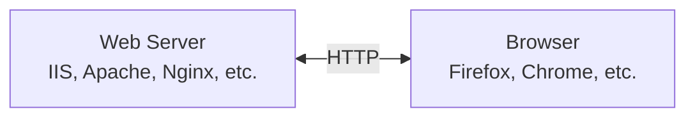
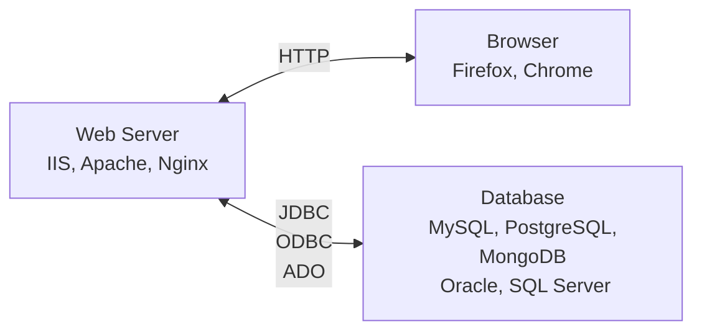

# Hacking Web Servers


Objectives
---
- Describe Web applications and their vulnerabilities
- Exploit Web application vulnerabilities
- Attack Web servers with tools


B/S (browser/server) architecture
---




Web servers
---
- Explore web server market share
  - [Web server developers: Market share of all sites](https://news.netcraft.com/archives/category/web-server-survey/)


Understanding Web Applications
---
- It is nearly impossible to write a program without bugs
  - Some bugs create security vulnerabilities
- Web applications also have bugs
  - Web applications have a larger user base than standalone applications
  - Bugs are a bigger problem for Web applications


Web Application Components
---
- Static Web pages
  - Created using HTML
- Dynamic Web pages need special components
  - Client side
    - <form> tags
    - Scripting languages like JavaScript
  - Server side
    - Common Gateway Interface (CGI) scripts
    - Active Server Pages (ASP)
    - PHP
    - Databases


Web Forms
---
- Use the <form> element or tag in an HTML document
  - Allows customer to submit information to the Web server
- Web servers process information from a Web form by using a Web application
  - Online editors of user info, post, etc.
- Easy way for attackers to intercept data that users submit to a Web server


[HTML Forms](https://github.com/ufidon/its450/tree/master/lectures/module2/code/12.WebSQL/lec)
---
- Change password (POST form)

```html
<form action = "changepw.php" method = "POST">
  EID: <input type = "text" name = "EID" />
  Old Password: <input type = "text" name = "OldPassword" />
  New Password: <input type = "text" name = "NewPassword" />
  <input type = "submit" />
</form>
```

- Login (GET form)

```html
<form action = "getdata.php" method = "GET">
  EID: <input type = "text" name = "EID" />
  Password: <input type = "text" name = "Password" />
  <input type = "submit" />
</form>
```


Common Gateway Interface (CGI)
---
- Handles moving data from a Web server to a Web browser
- The majority of dynamic Web pages are created with 
  - CGI 
  - scripting languages


CGI Languages
---
- CGI programs can be written in different programming and scripting languages
  - C or C++
  - Perl
  - [Unix shell scripting](https://github.com/ufidon/its450/tree/master/labs/lab04/code)
  - Java
  - FORTRAN


Practice on CGI examples 📝
---
- CGI Programming in Python

```bash
# create directories
mkdir pythonweb pythonweb/{cgi-bin,htbin}
cd pythonweb

# create cgi program in Python
touch htbin/hello.py
# open htbin/hello.py, paste the code below, save it
mousepad htbin/hello.py
chmod +x htbin/hello.py

# run python http.server with cgi support
python3 -m http.server --bind localhost --cgi 8000

# open the website
python3 -m http.server --bind localhost --cgi 8000
# or type the address http://localhost:8000/htbin/hello.py in a browser
```

```python
#!/usr/bin/env python3
# file name: hello.py
print("Content-Type: text/html\n")
print("<!doctype html><title>Hello</title><h2>hello world</h2>")
```

- [CGI Programming in Perl](https://metacpan.org/pod/HTTP::Server::Simple::CGI)
  - [Explore HTTP::Server::Simple::CGI](https://lethain.com/intro-to-http-server-simple-cgi/)

```bash 
mkdir perlcgi
cd perlcgi

sudo perl -MCPAN -e shell
# enter cpan
install HTTP::Server::Simple::CGI
# wait until it is done, exit cpan
exit

# use an editor to copy the perl code below into hi.pl
mousepad hi.pl

# run hi.pl
chmod +x hi.pl
./hi.pl

# in the browser address box, type http://localhost:8080/hello
```


```perl
#!/bin/perl
# copy from https://metacpan.org/pod/HTTP::Server::Simple
{
package MyWebServer;
 
use HTTP::Server::Simple::CGI;
use base qw(HTTP::Server::Simple::CGI);
 
my %dispatch = (
    '/hello' => \&resp_hello,
    # ...
);
 
sub handle_request {
    my $self = shift;
    my $cgi  = shift;
   
    my $path = $cgi->path_info();
    my $handler = $dispatch{$path};
 
    if (ref($handler) eq "CODE") {
        print "HTTP/1.0 200 OK\r\n";
        $handler->($cgi);
         
    } else {
        print "HTTP/1.0 404 Not found\r\n";
        print $cgi->header,
              $cgi->start_html('Not found'),
              $cgi->h1('Not found'),
              $cgi->end_html;
    }
}
 
sub resp_hello {
    my $cgi  = shift;   # CGI.pm object
    return if !ref $cgi;
     
    my $who = $cgi->param('name');
     
    print $cgi->header,
          $cgi->start_html("Hello"),
          $cgi->h1("Hello $who!"),
          $cgi->end_html;
}
 
} 
 
# start the server on port 8080
my $pid = MyWebServer->new(8080)->background();
print "Use 'kill $pid' to stop server.\n";
```

- Explore [Apache CGI](https://httpd.apache.org/docs/2.4/howto/cgi.html)
  - [httpd-cgi](https://github.com/hypoport/httpd-cgi)
  - [Docker httpd apache and getting cgi-bin to execute perl script](https://stackoverflow.com/questions/64743879/docker-httpd-apache-and-getting-cgi-bin-to-execute-perl-script)


[Active Server Pages (ASP)](https://dotnet.microsoft.com/en-us/apps/aspnet)
---
- Microsoft’s server-side script engine
  - HTML pages are static—always the same
  - ASP creates HTML pages as needed.  They are not static
- ASP uses scripting languages such as JScript, VBScript or C#
- Not all Web servers support ASP
  - IIS supports ASP
  - Apache doesn’t support ASP as well
- the source of an ASP page does not show on a browser
  - harder to hack into, although not impossible


Apache Web Server
---
- a popular Web Server program
- Stable and reliable
- Works on any *NIX and Windows platform
- free and open source


Using Scripting Languages
---
- Dynamic Web pages can be developed using scripting languages
  - [Java Servlet and JSP (Java Server Page)](https://www.geeksforgeeks.org/difference-between-servlet-and-jsp/)
  - C#
  - JavaScript
  - PHP


PHP: Hypertext Processor (PHP)
---
- Used to create dynamic Web pages
  - Similar to ASP
- Open-source server-side scripting language
  - embedded in an HTML Web page using PHP tags \<?php and ?\>
  - often used with MySQL Databases
- Used primarily on UNIX systems
  - Also supported on Macintosh and Microsoft platforms
- has known [vulnerabilities](https://cve.mitre.org/cgi-bin/cvekey.cgi?keyword=php)


VBScript
---
- a scripting language developed by Microsoft
  - works in IE, but not in Firefox
- makes a static HTML page dynamic
  - Provides the power of a full programming language
  - Executed by the client’s browser
  - has known [vulnerabilities](https://cve.mitre.org/cgi-bin/cvekey.cgi?keyword=vbscript)


JavaScript
---
- a popular scripting language
- the power of a programming language
- a popular server-side script as well
  - [node.js](https://nodejs.org)


Practice 📝
---
- Choose a webpage, view its source code
  - find any javascript
- find known javascript vulnerabilities on [CVE](https://cve.mitre.org/cve/search_cve_list.html)
- find the popularity of programming languages using Google
  - which of them can be used to develop web apps?


Browser/Server/Database architecture
---




Connecting to Databases
---
- Web pages can display information stored on databases
- There are several technologies used to connect databases with Web applications
- Technology depends on the database, PL and OS used
  - JDBC
  - ODBC
  - OLE DB and ADO


Open Database Connectivity (ODBC)
---
- Standard database access method developed by the SQL Access Group
  - allows an application to access
    - Database managed by a database management system (DBMS)
  - supports Oracle, MySQL, or any DBMS 
    - that understands and can issue ODBC commands
- It defines
  - Standardized representation of data types
  - A library of ODBC functions
  - Standard methods of connecting to and logging on to a DBMS
- Interoperability among back-end DBMS is a key feature of the ODBC interface


OLE DB and ADO
---
- Object Linking and Embedding Database (OLE DB) and
- ActiveX Data Objects (ADO)
- These two more modern, complex technologies 
  - replace ODBC and 
  - make up"Microsoft’s Universal Data Access“


Understanding Web Application Vulnerabilities
---
- Many platforms and programming languages can be used to design a Web site
- Application security is as important as network security


Attackers controlling a Web server can
---
- Deface the Web site
- Destroy or steal company’s data
- Gain control of user accounts
- Perform secondary attacks from the Web site
- Gain root access to other applications or servers


Open Web Application Security Project [(OWASP)](https://owasp.org/)
---
- Open, nonprofit organization dedicated to 
  - finding and fighting vulnerabilities in Web applications
- Publishes the Ten Most Critical Web Application Security Vulnerabilities


Practice 📝
---
- Explore [Top 10 Web Application Security Risks 2021](https://owasp.org/www-project-top-ten/)


Cross-Site Scripting (XSS)
---
- One client posts active content, with \<script\> tags or other programming content
- When another client reads the messages, the scripts are executed in his or her browser
- One user attacks another user, using the vulnerable Web application as a weapon


XSS Scripting Effects
---
- Steal another user's authentication cookie
  - Hijack session
- Harvest stored passwords from the target's browser
- Take over machine through browser vulnerability
- Redirect Webpage


Issues to consider when assessing Web Applications
---
- Dynamic Web pages
- Connection to a backend database server
- User authentication 
- What platform was used?


Does the Web Application Use Dynamic Web Pages?
---
- Static Web pages do not create a secure environment
- IIS attack example: [Directory Traversal](https://cve.mitre.org/cgi-bin/cvekey.cgi?keyword=IIS)


Connection to a Backend Database Server
---
- possibility of SQL injection
  - supplying SQL commands on a Web application field
- Basic testing should look for whether you can
  - enter text with punctuation marks
  - enter a single quotation mark followed by any SQL keywords
  - get any sort of database error when attempting to inject SQL


SQL Injection Example
---
- HTML form collects name and pw
  - SQL then uses those fields:

```sql
SELECT * FROM customer
WHERE username = 'name' AND password = 'pw' 
-- If a hacker enters a name of 
' OR 1=1 --
-- The SQL becomes:
SELECT * FROM customer
WHERE username ='' OR 1=1 --' AND password = 'pw'
-- Which is always true, and returns all the records
```


User Authentication
---
- Many Web applications require another server to authenticate users
- Examine how information is passed between the two servers
  - Encrypted channels
- Verify that logon and password information is stored on secure places
- Authentication servers introduce a second target


What Platform Was Used?
---
- Popular platforms include:
  - IIS with ASP and SQL Server (Microsoft)
  - Linux, Apache, MySQL, and PHP (LAMP)
- Footprinting is used to find out the platform
  - the more about a system 
  - the easier to gather information about its vulnerabilities


Practice 📝
---
- Study [SQL injection on various databases](https://book.hacktricks.xyz/pentesting-web/sql-injection)
- Study [OWASP Web Security Testing Guide](https://owasp.org/www-project-web-security-testing-guide/)


Tools of Web Attackers and Security Testers
---
- Choose the right tools for the job
- Attackers look for tools attacking the system
  - based on the vulnerabilities found on a target


Web Tools
---
- Firefox and Chrome Developer Tools
  - View parameters and cookies
  - Modify and resend requests
- BurpSuite and Zed Attack Proxy
  - Powerful proxy used for Web App hacking
  - Can do simple vulnerability scans
- [nikto - web server scanner](https://github.com/sullo/nikto)
- [skipfish - web application scanner](https://www.kali.org/tools/skipfish/)
- [w3af - a Web Application Attack and Audit Framework](http://w3af.org/)
- Nessus and OpenVAS


Practice 📝
---
- Explore the following projects
  - [OWASP WebGoat](https://owasp.org/www-project-webgoat/)
  - [MCIR - The Magical Code Injection Rainbow](https://github.com/SpiderLabs/MCIR)


# References
- [Computer Systems Fundamentals](https://w3.cs.jmu.edu/kirkpams/OpenCSF/Books/csf/html/index.html)
- [How to run CGI "hello world" with python http.server](https://stackoverflow.com/questions/30516414/how-to-run-cgi-hello-world-with-python-http-server)
- [CGI Programming with Perl](https://www.oreilly.com/library/view/cgi-programming-with/1565924193/)
  - [Perl CGI](http://www.perlmeme.org/tutorials/cgi_script.html)
    - [CGI.pm](https://metacpan.org/release/LDS/CGI.pm-3.42/view/CGI.pm)